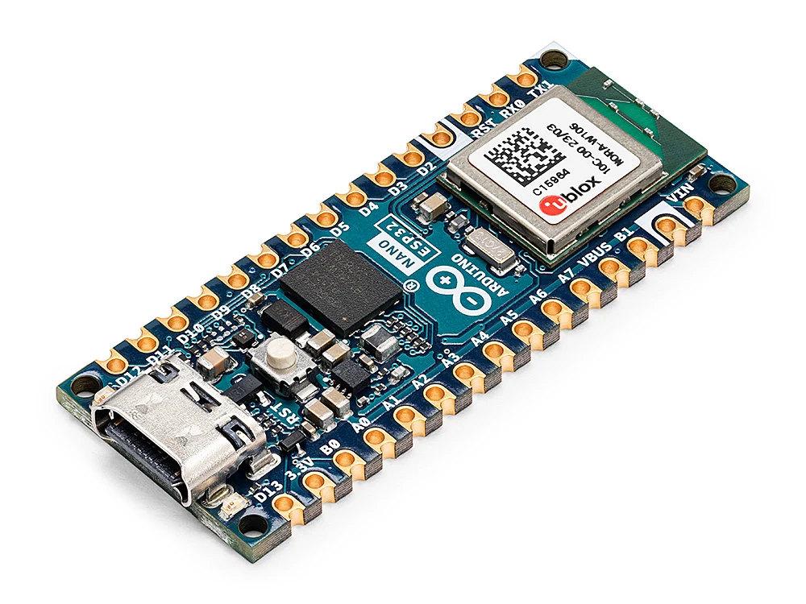
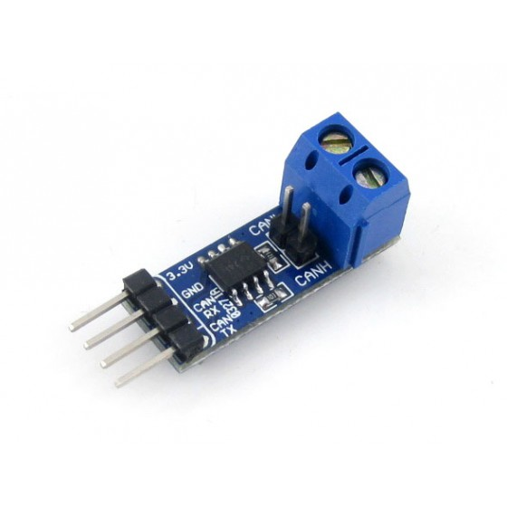
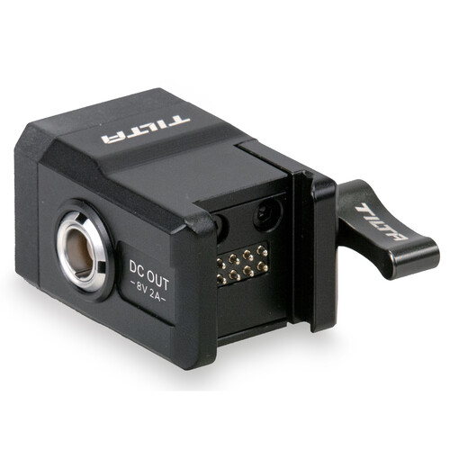
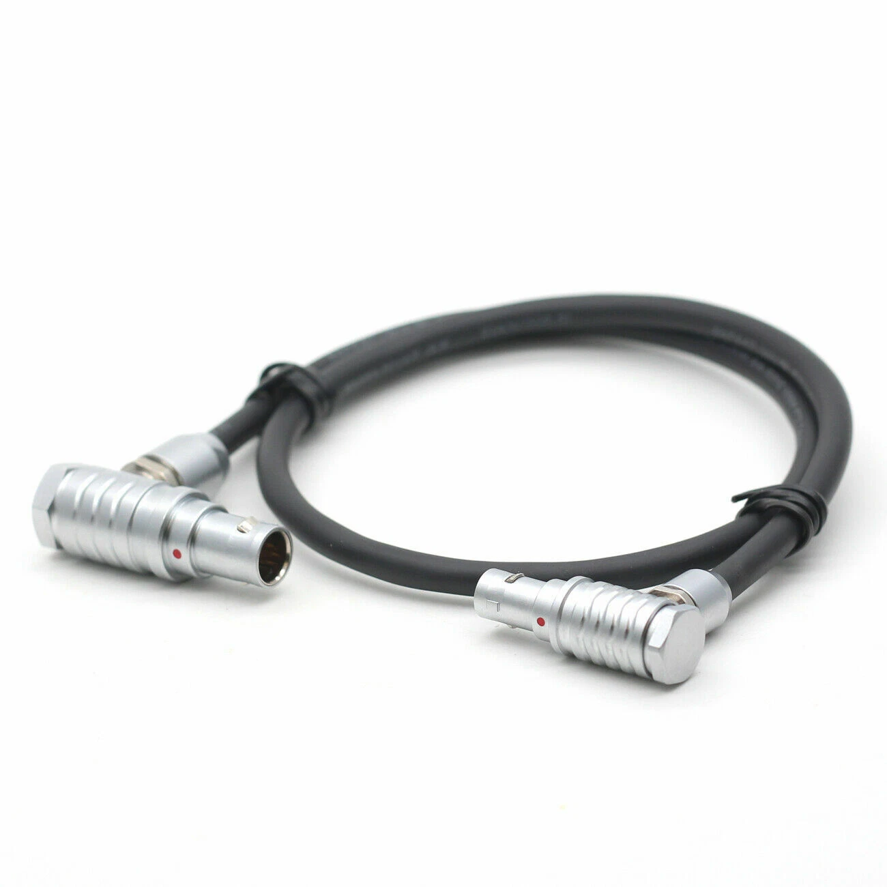

# ESP32 DJI Ronin Controller
Example to control a DJI Ronin Gimbal with an ESP32 chip

## Hardware

- DJI Ronin Gimbal (compatible with RS4, RS4 pro, RS5, etc)
- ESP32 chip: Arduino Nano ESP32
- CAN Transreceiver: I'm using a Waveshare SN65HVD230 CAN Board, but other CAN transreceiver also works.
- Tilta Wired Control Receiver
- 6-pin power control cable to connect the Tilta Receiver and CAN transreceiver. (Can be found on eBay)

Note that some wiring and soldering may be required to connect all the components.

    
    
    
    

## Run
- Clone the repo into your Arduino folder (e.g. `~/Documents/Arduino`)

- Open the Arduino IDE and run the example `esp32-dji-ronin-controller`
